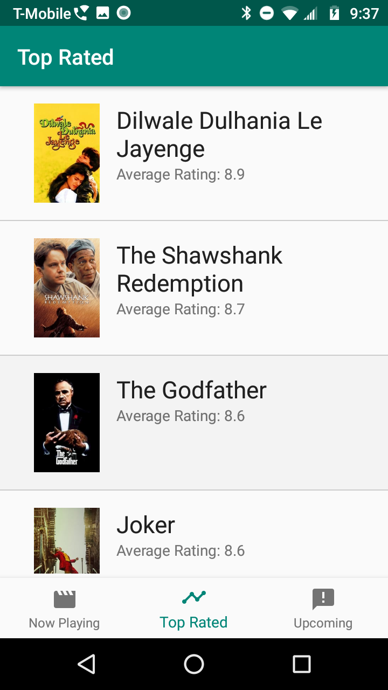
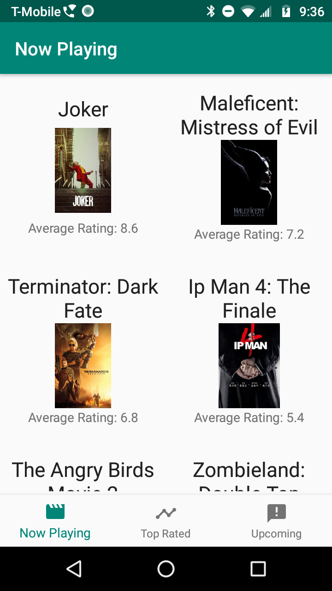
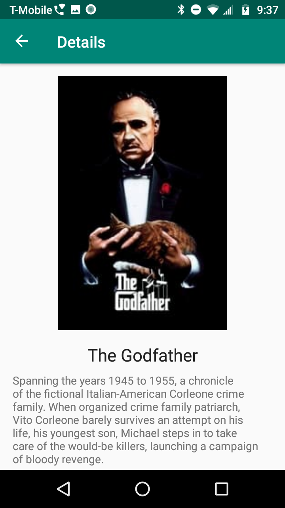

# MdbforGloo

### Summary

This app uses The Movie Database API to fetch JSON objects containing information about movies. That data is then displayed using a recycler view. The images are loaded and cached with Glide. 
I have used an indeterminate progress indicator during loading for all screens and activated the back button in the action bar. Assumptions made: The app should be in English, it would not be necessary to
limit the results by region, a 'unique' display as requested could be acheived by changing as little as which side of the view the image was displayed on. Tests could be written to ensure that the API layer
is working properly, the data is being saved, and the UI is being displayed.  

### API Used

##The Movie Database

Base URL: https://developers.themoviedb.org/3

## Endpoints

GET
/movie/{movie_id}

GET
/movie/now_playing

GET
/movie/top_rated

GET
/movie/upcoming

### Screenshots

The app provides three sets of movies:  
Top Rated, Now Playing, and Upcoming. Here are two of those screens:  
   
  
When a user clicks on a movie they are taken to a Details screen:  
  

### Tech used

JetPack, Glide, OkHTTP, Retrofit, Moshi
